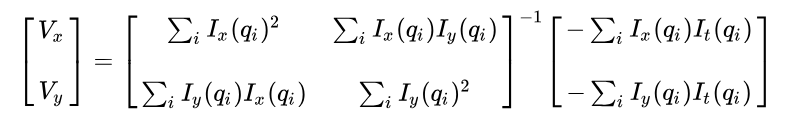

# lucas-kanade
Simple C++ implementation of Lucas-Kanade optical flow using OpenCV. 

**Note:**  
This implementation is written with a focus on clarity and mathematical transparency rather than low-level optimizations.  
But it should run in real-time on any CPU > the year 2010.

The original paper can be found here: [An Iterative Image Registration Technique with an Application to Stereo Vision](https://cseweb.ucsd.edu/classes/sp02/cse252/lucaskanade81.pdf)


*Showing optical flow using lucas-kanade; Raw video taken from https://www.youtube.com/watch?v=zOq2XdwHGT0*

We calculate the optical flow using Equation (1).
For more details, see the [Lucas–Kanade method](https://en.wikipedia.org/wiki/Lucas%E2%80%93Kanade_method) on Wikipedia or the original paper  [An Iterative Image Registration Technique with an Application to Stereo Vision](https://cseweb.ucsd.edu/classes/sp02/cse252/lucaskanade81.pdf).

*Equation (1); Taken from https://en.wikipedia.org/wiki/Lucas%E2%80%93Kanade_method*

## Usage
OpenCV, CMake, Make (and a compiler :D) is assumed to be installed.

(1) The CMakeLists.txt should look like this:

```cmake
cmake_minimum_required(VERSION 3.5)
project( lucas-kanade )
find_package( OpenCV REQUIRED )
include_directories( ${OpenCV_INCLUDE_DIRS} )
add_executable( run run.cpp src/lucas_kanade.cpp )
target_link_libraries( run ${OpenCV_LIBS} )
```

(2) Generate the executable, make sure your in the repository folder.
```bash
cmake .
make
```

(3.1) Run with internal webcam (if available; press any key to quit):
```bash
./run
```

(3.2) Run with video from file (press any key to quit):
```bash
./run your_video.avi
```

## Citations
```bibtex
@inproceedings{10.5555/1623264.1623280,
author = {Lucas, Bruce D. and Kanade, Takeo},
title = {An iterative image registration technique with an application to stereo vision},
year = {1981},
publisher = {Morgan Kaufmann Publishers Inc.},
booktitle = {Proceedings of the 7th International Joint Conference on Artificial Intelligence - Volume 2},
pages = {674–679},
numpages = {6},
location = {Vancouver, BC, Canada},
series = {IJCAI'81}
}
```